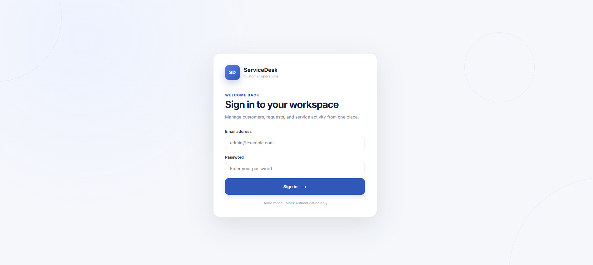
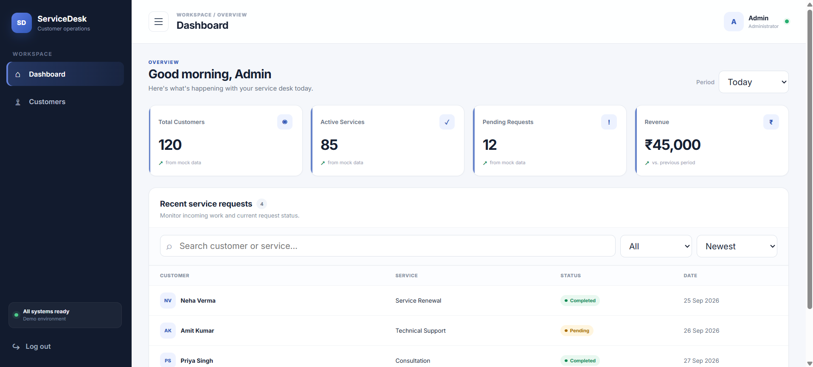
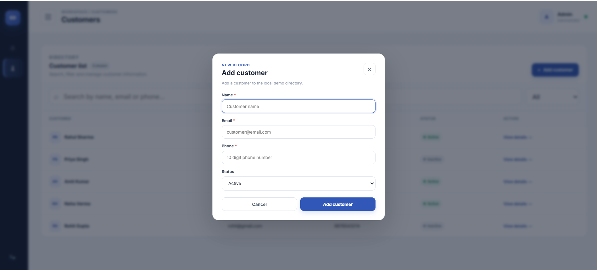
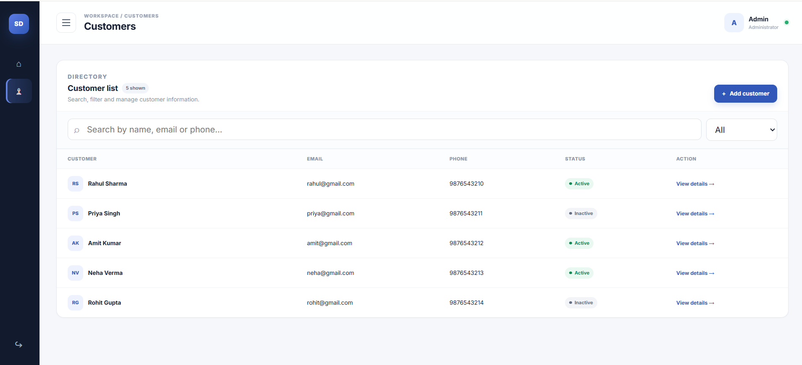

# Customer Service Dashboard

A frontend customer service dashboard The project was developed in three stages, starting with the basic dashboard structure and then adding interactions, customer management, validation, responsive behavior, UI refinement, and testing.

The application uses mock data only. There is no backend, API, database, or real authentication.

## Project Overview

ServiceDesk is a small admin dashboard for managing customer information and monitoring service requests.

Main areas:

- Demo login
- Dashboard overview
- Service request monitoring
- Customer directory
- Customer search and filtering
- Add customer form
- Customer details
- Responsive navigation
- Validation and UI feedback

## Features

### Login

- Email format validation
- Required password validation
- Clear validation messages
- Demo login without real authentication
- Logout action

### Dashboard

- Total Customers, Active Services, Pending Requests, and Revenue cards
- Today / This Week / This Month period selection
- Mock values update when the period changes
- Loading feedback
- Service request search
- Status filter
- Sorting
- Empty/no-results state
- Clear-filter support

### Customers

- Search by name, email, or phone
- Active/Inactive status filter
- Add Customer modal
- Name, Email, Phone, and Status fields
- Required-field validation
- Email validation
- 10-digit phone validation
- Duplicate email prevention
- Submit/loading feedback
- Success message
- Newly added customers appear immediately
- Customer details modal

### UI and Responsive Design

- Responsive sidebar
- Desktop, tablet, and mobile layouts
- Responsive filters
- Horizontally scrollable tables
- Modal overlay
- Hover and focus states
- Escape-key and click-outside modal closing
- Reduced-motion support
- Consistent buttons, cards, forms, tables, and status badges

## Screenshots

### Login



### Dashboard



### Add Customer



### Customers



## Development Progress

### Day 1 — Basic Application

The first stage focused on creating the main application structure and screens.

Implemented:

- React + Vite setup
- Login screen
- Dashboard layout
- Sidebar and header
- Four summary cards
- Recent service requests table
- Customer list
- Customer search
- Customer status filter
- Add customer form
- Customer details modal
- Mock data
- Basic responsive styling

### Day 2 — Interactions and Reusable UI

The second stage focused on making the application functional and interactive.

Added:

- Login email validation
- Required password validation
- Login to dashboard flow
- Logout
- Dynamic dashboard summary data
- Today / This Week / This Month filter
- Service request search
- Service request status filter
- Service request sorting
- No-results state
- Customer search by name, email, or phone
- Customer status filtering
- Add Customer modal
- Customer form validation
- Adding customers to the current mock list
- Customer details modal
- Success feedback
- Loading state
- Reusable UI components
- Responsive sidebar and tables
- Separate mock-data file

### Day 3 — UI Refinement and Testing

The third stage focused on polishing the interface and reviewing the main user flows.

Added/refined:

- Cleaner professional dashboard UI
- Consistent visual styles
- Improved cards, tables, forms, buttons, and status badges
- Better responsive behavior
- Mobile navigation drawer
- Modal Escape-key support
- Click-outside modal closing
- Duplicate email validation
- Submit protection
- Improved feedback states
- Accessibility-focused labels and focus states
- Reduced-motion support
- Testing checklist
- Updated documentation

## Tech Stack

- React 18
- Vite
- JavaScript
- JSX
- CSS
- Mock JavaScript data

No UI framework or backend service is required.

## Project Structure

```text
customer-service-dashboard/
│
├── node_modules/
├── src/
│   ├── data/
│   │   └── mockData.js
│   ├── main.jsx
│   └── styles.css
│
├── screenshots/
│   ├── login.png
│   ├── dashboard.png
│   ├── add-customer.png
│   └── customers.png
│
├── .gitignore
├── index.html
├── package.json
├── package-lock.json
├── README.md
└── TESTING_CHECKLIST.md
```

### Main files

**`src/main.jsx`**  
Contains the React application, UI components, state management, validation, filtering, sorting, modal handling, and page switching.

**`src/data/mockData.js`**  
Contains the starting dashboard statistics, customers, and service requests. Keeping the data separate makes the UI easier to maintain and makes it easier to replace mock data with API data later.

**`src/styles.css`**  
Contains the application's layout, colors, typography, responsive rules, forms, tables, cards, sidebar, modals, and other UI styling.

**`index.html`**  
The HTML entry point containing the root element where React mounts the application.

**`package.json`**  
Contains the project dependencies and npm scripts.

**`TESTING_CHECKLIST.md`**  
Contains the Day-3 functional, responsive, and accessibility testing checklist.

## Application Flow

```text
Login
  |
  | valid email + password
  v
Dashboard
  |
  +--------------------+
  |                    |
  v                    v
Dashboard           Customers
  |                    |
  |                    +--> Search
  |                    +--> Status Filter
  |                    +--> Add Customer
  |                    +--> Validation
  |                    +--> Customer Details
  |
  +--> Period Filter
  +--> Summary Cards
  +--> Search Requests
  +--> Status Filter
  +--> Sorting
  +--> Empty State
  |
  v
Logout
  |
  v
Login
```

## Data Flow

The application currently uses local mock data:

```text
mockData.js
     |
     v
React components
     |
     v
React state
     |
     +--> Search
     +--> Filters
     +--> Sorting
     +--> Modal state
     +--> Form state
     |
     v
Updated UI
```

There is intentionally no API or database in this version.

New customers are stored in React state for the current browser session. A full page refresh restores the original mock customer list.

## Running the Project

### Requirements

- Node.js 18 or later recommended
- VS Code

### Install dependencies

```bash
npm install
```

### Start development server

```bash
npm run dev
```

Open the local URL shown by Vite, normally:

```text
http://localhost:5173
```

### Production build

```bash
npm run build
```

### Preview production build

```bash
npm run preview
```

## Demo Login

This is a frontend-only demo.

Use any valid email address and any non-empty password.

Example:

```text
Email: admin@example.com
Password: demo123
```

No real account is created and no credentials are sent to a server.

## Testing

### Login

- [x] Empty email/password validation
- [x] Invalid email validation
- [x] Successful login
- [x] Logout

### Dashboard

- [x] Period selection
- [x] Summary card updates
- [x] Loading feedback
- [x] Service request search
- [x] Status filter
- [x] Sorting
- [x] No-results state
- [x] Clear filters

### Customers

- [x] Search by name
- [x] Search by email
- [x] Search by phone
- [x] Status filter
- [x] Add customer modal
- [x] Required field validation
- [x] Email validation
- [x] Phone validation
- [x] Duplicate email validation
- [x] Customer creation
- [x] Success feedback
- [x] Customer details modal

### Responsive and accessibility checks

- [x] Desktop layout
- [x] Tablet layout
- [x] Mobile navigation
- [x] Responsive tables
- [x] Visible focus states
- [x] Form labels
- [x] Modal Escape-key closing
- [x] Reduced-motion preference

## Known Limitations

This project is intentionally a frontend prototype.

- Authentication is simulated.
- Customer data is not stored in a database.
- Newly added customers reset after a full page refresh.
- Dashboard statistics are predefined mock values.
- Service requests are read-only.
- There is no backend/API integration.

For a production version, the mock data could be replaced with REST APIs and persistent database storage.

## Future Improvements

Possible next steps:

- Backend API integration
- Database persistence
- Real authentication and authorization
- Customer edit/delete operations
- Service request creation and management
- Pagination
- Server-side search and filtering
- User roles and permissions
- Activity history
- Dashboard charts and reports

## Live link

https://customer-service-dashboard-brown.vercel.app/

## GitHub

Repository:

https://github.com/prasoonpathak967/customer-service-dashboard


